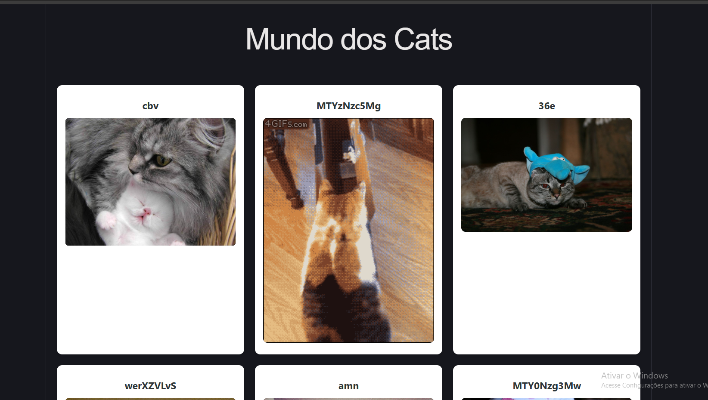

<div align="center">
  
  <b>`プ ロ グ ラ マ`</b>
  <br>
  <samp>
      Hi there! I'm <b>Valakzz</b> 👋
      <br>
      Kotlin • Back-end • Dev in progress
  </samp>
  #

  # 網站 Sistema de Cats com API pública
  


# 🐱 ReactApiCat

Projeto desenvolvido para praticar o consumo de APIs utilizando React, TypeScript e Vite.

A aplicação utiliza a **The Cat API** para buscar imagens de gatos e exibi-las dinamicamente na tela.

## 🚀 Tecnologias utilizadas

- React
- TypeScript
- Vite
- CSS
- Fetch API
- The Cat API

## 📌 Funcionalidades

- 🔄 Consumo de uma API externa
- 🐱 Busca de imagens de gatos
- 🖼️ Exibição das imagens em cards
- ⚛️ Utilização de componentes React
- 🔷 Tipagem dos dados utilizando TypeScript
- 📡 Requisições utilizando `fetch`

## API Usada
```bash
https://api.thecatapi.com/v1/images/search?limit=5
```

## 📂 Estrutura do projeto

```text
src/
├── assets/
├── card/
├── App.tsx
├── App.css
├── index.css
└── main.tsx
